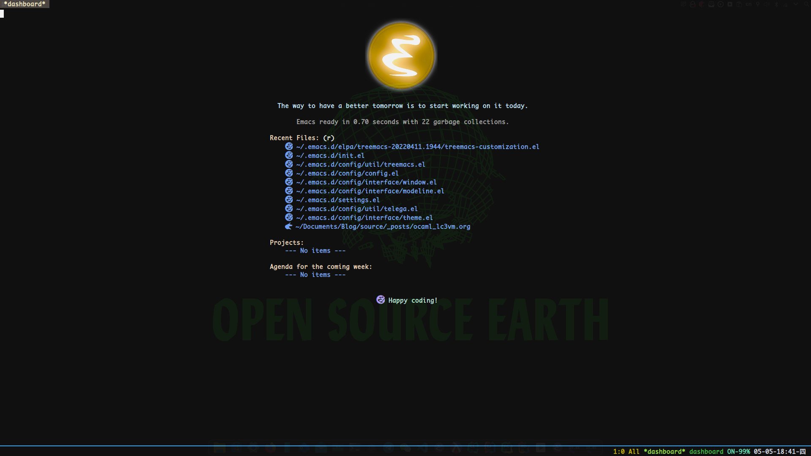
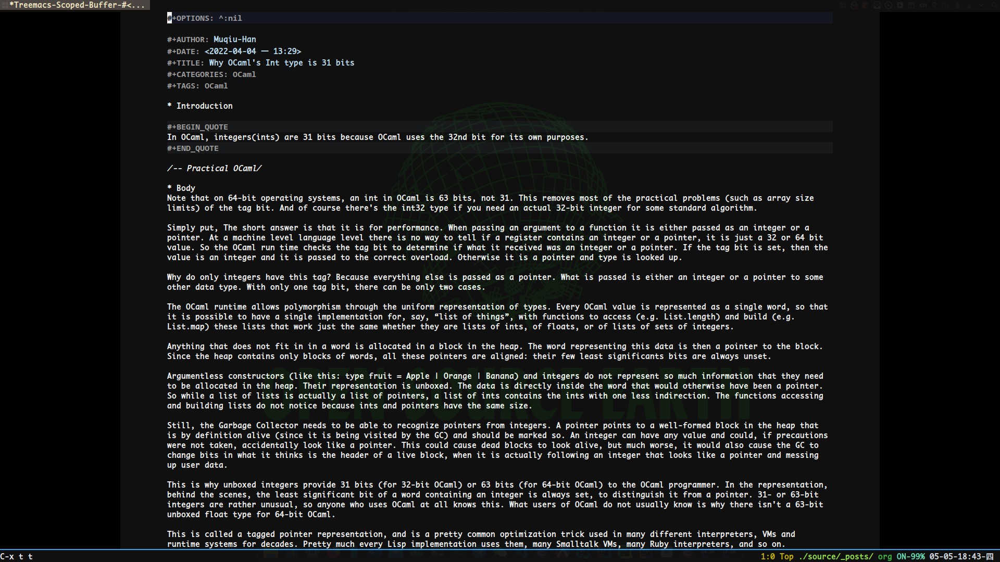

AutumnEmacs is a minimalist GNU Emacs configuration, which will pre-configure OCaml, Racket, Clojure, CommonLisp, Scheme, and EmacsLisp development environments for you, including some related productivity plugins.

---

note that: You first need to write settings.el to customize your configuration

---

wish you a happy life.
