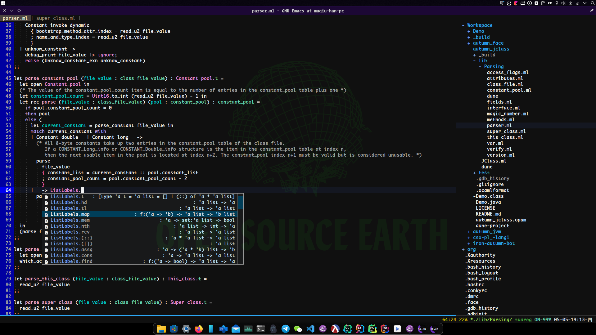
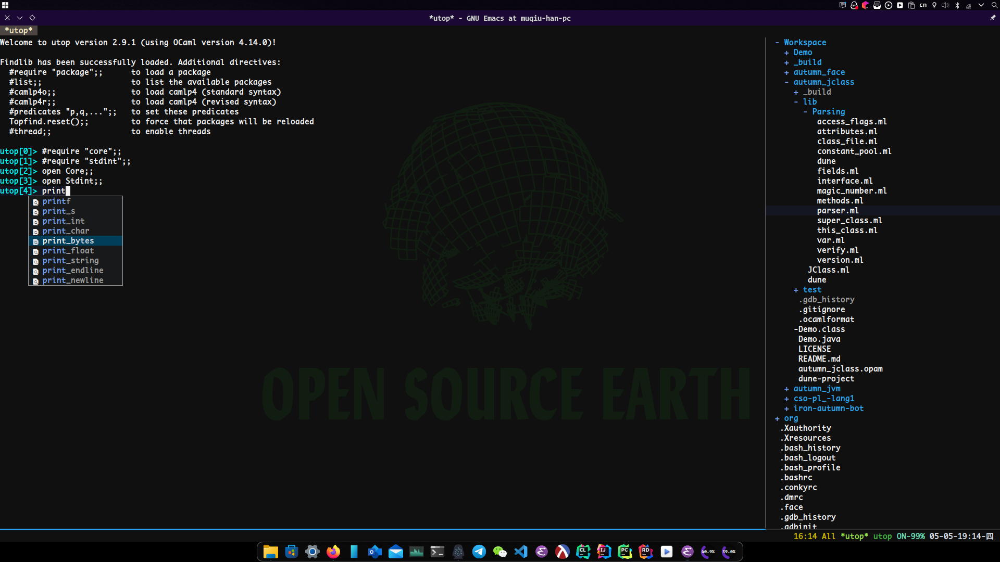
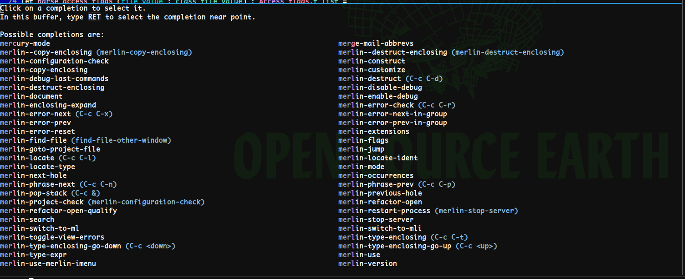
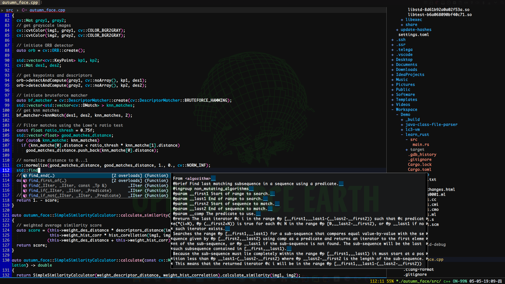
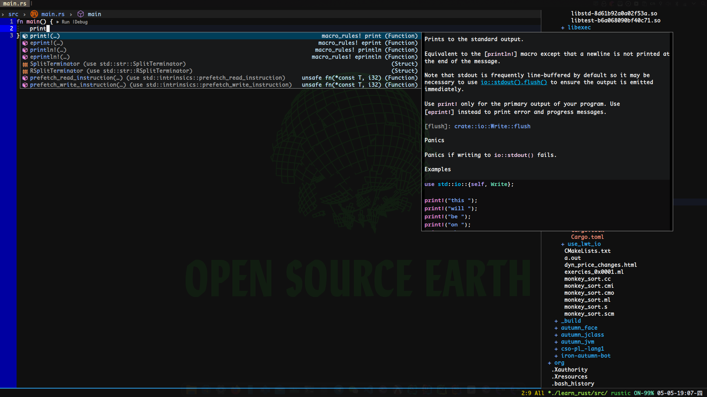
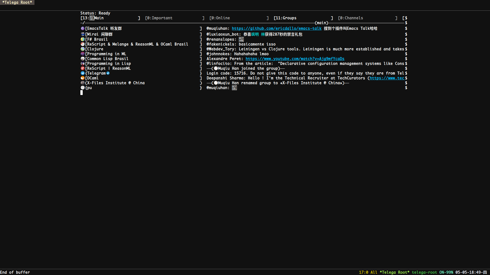
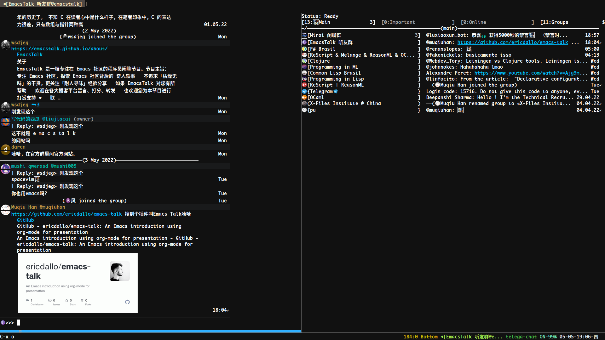

# INTRODUCTION
AutumnEmacs is a minimalist GNU Emacs configuration, which will pre-configure OCaml, Racket, Clojure, CommonLisp, Scheme, and EmacsLisp development environments for you, including some related productivity plugins.

# USAGE
Customize the components of the profile by changing the constant values in settings.el

# PREVIEW

- Dashboard

- Org-mode

- OCaml Environment

- Lsp support

- Telegram Client

---

While any text editor can save your files, only Emacs can save your soul.
